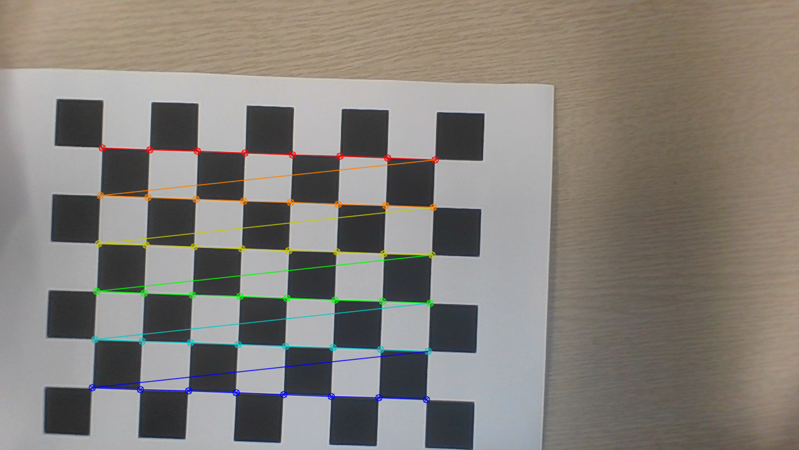
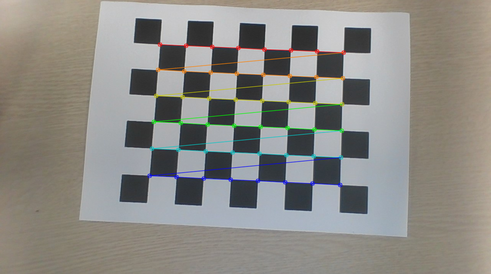

# How to calibrate cameras

### Calibrating using checker board

  

### Capture images of the checkerboard and run calibrate.py

  
  
  
  

- Camera Calibration Overview

https://docs.opencv.org/4.x/dc/dbb/tutorial_py_calibration.html

- Calibration Checkerboard Collection

https://markhedleyjones.com/projects/calibration-checkerboard-collection
